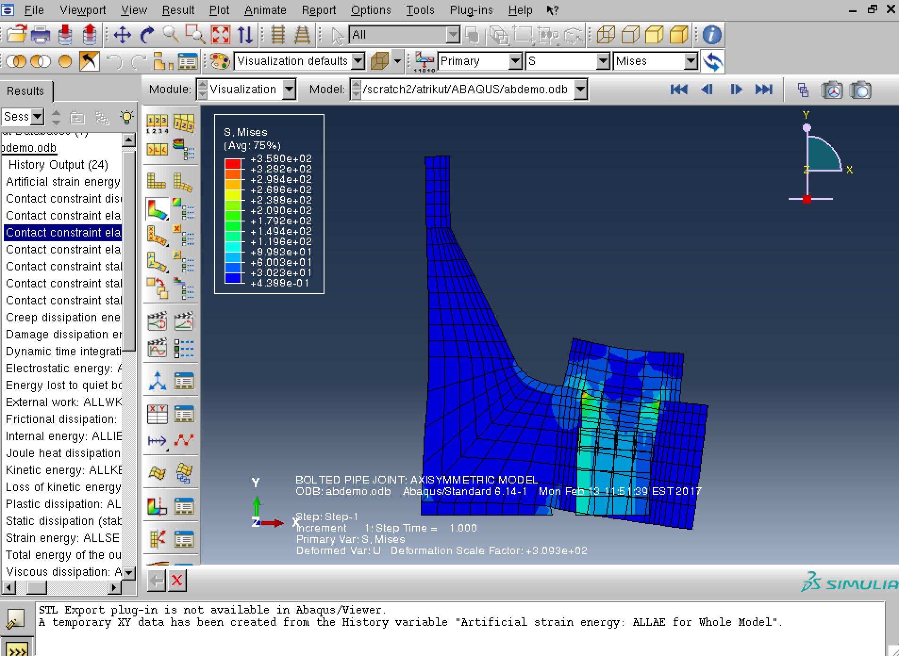

## ABAQUS

ABAQUS is a Finite Element Analysis software used
for engineering simulations.
Currently, ABAQUS version 2023 is available on Palmetto cluster as modules.

NOTICE: Abaqus cannot run on multiple nodes on Palmetto. The RCDE team is still work on this issue.
~~~
$ module avail abaqus

----------------------------------------------------- Commercial/External Modules ------------------------------------------------------
   abaqus/2023
~~~

To see license usage of ABAQUS-related packages,
you can use the `lmstat` command:

~~~
/hpc/flexlm/lmstat -a -c /hpc/flexlm/licenses/abaqus.dat
~~~

### Running ABAQUS in batch mode

We have provided four job scripts in this repo for different schedulers (PBS and SLURM) and different accelerators (CPU and GPU).
To run ABAQUS in batch mode on Palmetto cluster, you can use the one of the job scripts as a template.
This repo also consists of the "Axisymmetric analysis of bolted pipe flange connections"
example provided in the ABAQUS documentation [here](http://bobcat.nus.edu.sg:2080/v6.14/books/exa/default.htm).
Please see the documentation for the physics and simulation details.
You can obtain the files required to run this example
using the following commands:

~~~
$ cd /scratch/$USER
$ git clone git@github.com:clemsonciti/palmetto-examples.git
$ cd palmetto-examples/ABAQUS/SLURM
$ ls

abaqus_cpu.slurm  abaqus-screenshot-results.png   boltpipeflange_axi_node.inp       get_env.py
abaqus_gpu.slurm  boltpipeflange_axi_element.inp  boltpipeflange_axi_solidgask.inp  README.md
~~~

The `.inp` files describe the model and simulation to be performed - see
the documentation for details.
The batch script `abaqus_cpu.slurm` and `abaqus_gpu.slrum` submits the job to the cluster with different accelerator. The python script `get_env.py` is used for running across different nodes, .e.g `--nodes` larger than one.

To submit the job using CPU only and using SLURM scheduler:

~~~
$ sbatch abaqus_cpu.slurm
~~~

After job completion, you will see the job submission directory (`$SLURM_SUBMIT_DIR`)
populated with various files.

The output database (`.odb`) file
contains the results of the simulation which can be viewed
using the ABAQUS viewer using the Virtual Desktop on [OpenOnDemand](https://ondemand.rcd.clemson.edu/).

Once logged-in to the Virtual Desktop, you can open a terminal on the Virtual Desktop.
You can load the `abaqus` module, and run the `abaqus` executable with the `viewer` and `-mesa` options:

~~~
$ module add abaqus/2023
$ abaqus viewer -mesa
~~~

Similarly,
to launch the ABAQUS CAE graphical interface:

~~~
$ abaqus cae -mesa
~~~
