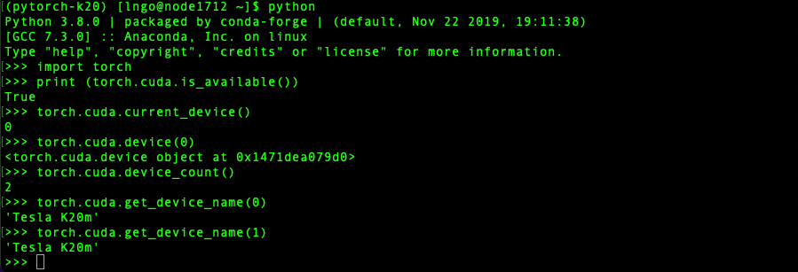
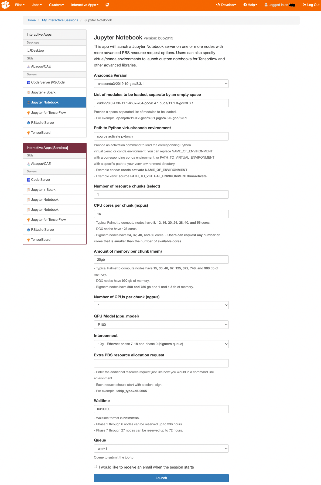

## Installing and running PyTorch on Palmetto

[PyTorch installation for P100/V100/A100](#pytorch-installation-for-p100v100a100) 
[PyTorch installation for K20/K40](#pytorch-installation-for-k20k40) 
[PyTorch on OpenOnDemand](#pytorch-on-openondemand) 

This page explains how to install the [PyTorch](https://pytorch.org/) 
package for use with GPUs on the cluster, and how to launch a JupyterLab 
Server with PyTorch environment on 
[OpenOnDemand](https://openod02.palmetto.clemson.edu).

### PyTorch installation for P100/V100/A100

1) Request an interactive session on a GPU node.

~~~
qsub -I -l select=1:ncpus=16:mem=20gb:ngpus=1:gpu_model=p100:interconnect=10ge,walltime=3:00:00
~~~

2) Load the Anaconda module:

~~~
module load anaconda3/2022.05-gcc/9.5.0
~~~

3) Create a conda environment called pytorch_env (or any name you like):

~~~
conda create -n pytorch python=3.10
~~~

4) Activate the conda environment:

~~~
source activate pytorch
~~~

5) Install Pytorch with GPU support from the pytorch channel:

~~~
conda install pytorch torchvision torchaudio pytorch-cuda=11.7 -c pytorch -c nvidia
conda install jupyterlab requests
~~~

*JupyterLab version needs to be fixed as the new version has 
conflicting configuration parameters*

7) You can now run Python and test the install:

~~~~
$ python
>>> import torch
>>> print (torch.cuda.is_available())
True
~~~~

Each time you login, you will first need to load the required anaconda module and also activate the `pytorch` conda environment before running Python:

~~~
module load anaconda3/2022.05-gcc/9.5.0
source activate pytorch
~~~

### PyTorch installation for K20/K40

1) Request an interactive session on a GPU node.

~~~
qsub -I -l select=1:ncpus=15:mem=62gb:ngpus=2:gpu_model=k20,walltime=24:00:00
~~~

2) Load the Anaconda module:

~~~
module load anaconda3/2022.05-gcc/9.5.0 cuda/11.1.1-gcc/9.5.0 cudnn/8.0.5.39-11.1-gcc/9.5.0-cu11_1 openmpi/4.1.3-gcc/9.5.0-ucx gcc/9.5.0 mpfr/4.1.0-gcc/9.5.0
~~~

3) Create a conda environment called pytorch_k20 (or any name you like):

~~~
conda create -n pytorch-k20 python=3.8
~~~

4) Activate the conda environment:

~~~
source activate pytorch-k20
~~~

5) Install Pytorch with GPU support from the pytorch channel:

~~~
pip install /zfs/citi/software/pytorch/wheel/torch-1.10.1-cp38-cp38-linux_x86_64.whl 
pip install torchvision=0.11.2 torchaudio=0.10.1
~~~

6) Install additional packages (for example, Pandas and JupyterLab)

~~~
conda install pandas jupyterlab requests numpy
~~~

7) You can now run Python and test the install:

~~~~
python
>>> import torch
>>> print (torch.cuda.is_available())
True
>>> torch.cuda.current_device()
0
>>> torch.cuda.device(0)
<torch.cuda.device object at 0x14ee008c8700>
>>> torch.cuda.device_count()
2
>>> torch.cuda.get_device_name(0)
'Tesla K20m'
>>> torch.cuda.get_device_name(1)
'Tesla K20m'
~~~~

Each time you login, you will first need to load the required modules and also activate the pytorch_env conda environment before running Python:

~~~
$ module load anaconda3/2019.10-gcc/8.3.1 cudnn/8.0.4.30-11.1-linux-x64-gcc/8.4.1 cuda/11.1.0-gcc/8.3.1 openmpi/4.0.3-gcc/8.3.1-ucx gcc/9.3.0 mpfr/4.0.2-gcc/8.4.1
$ source activate pytorch-k20
~~~

### PyTorch on OpenOnDemand

- Go to [Palmetto's OpenOnDemand](https://openod02.palmetto.clemson.edu/) and sign in. 
- Under `Interactive Apps` tab, select `Jupyter Notebook`. 
- Make the following selections:
  - `Anaconda Version`: `anaconda3/2022.05-gcc/9.5.0`
  - `List of modules to be loaded, separate by an empty space`: `cudnn/8.0.5.39-11.1-gcc/9.5.0-cu11_1 cuda/11.1.1-gcc/9.5.0`
  - If it is the K20/K40 installation, you need to load: `cudnn/8.0.5.39-11.1-gcc/9.5.0-cu11_1 cuda/11.1.1-gcc/9.5.0 openmpi/4.1.3-gcc/9.5.0-ucx gcc/9.3.0 mpfr/4.1.0-gcc/9.5.0`
  - `Path to Python virtual/conda environment`: `source activate pytorch`
- Make the remaining selections according to how much resources you would need.
  - The screenshot below uses the same set of resources used for the initial installation of pytorch.
- Click `Launch` when done.    

Once the JupyterNotebook app has started, you can launch the Jupyter server.

As the Jupyter Server is launched directly out of the `jupyterlab` package
installed in the `pytorch` conda environment, no special kernel is needed. 
You can import and use PyTorch directly from the default `Python 3` kernel. 

