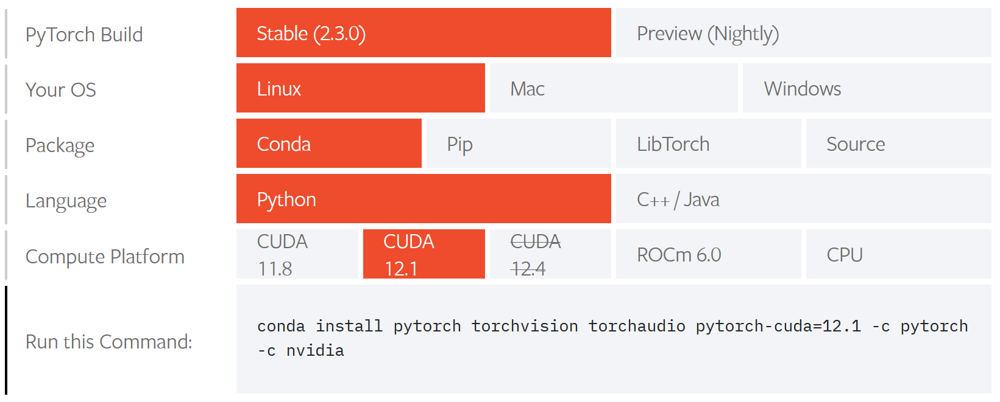
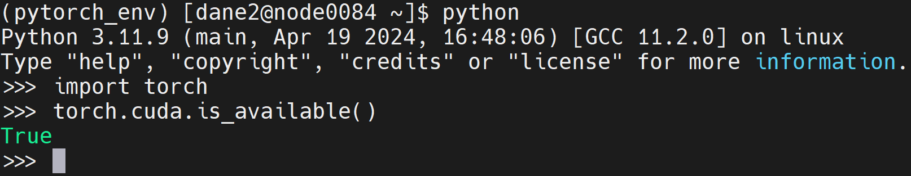
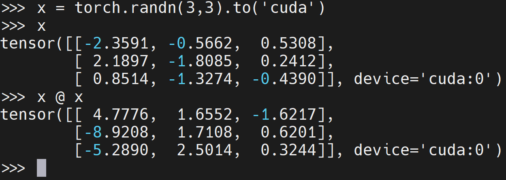

# Installing and running PyTorch on Palmetto

This page explains how to install the [PyTorch](https://pytorch.org/)
package for use with GPUs on Palmetto 2 and how to use this environment on [Open Ondemand](https://ondemand.rcd.clemson.edu/). In this tutorial, we use `conda` to create the python virtual environment and install the necessary python packages.

## Creating the conda environment

[Access the Palmetto 2 login node](https://docs.rcd.clemson.edu/palmetto/connect/ssh/).

We start by loading the anaconda module. We can do this on the login node, because, by default, Slurm will copy the setup performed by `module load` into any compute jobs we launch with `srun`. This saves us from having to load anaconda multiple times for different compute jobs.

```
module load anaconda3
```

Now request an interactive compute job for setting up the environment:

```
srun --cpus-per-task=4 --mem=8GB --time=1:00:00 --pty bash
```

Now we create a fresh conda environment. We will install PyTorch into this environment along with any other dependences. In this example, we call our environment `pytorch_env` and use python version 3.11. As of May 2024, PyTorch requires python 3.8 or newer. For the remainder of this tutorial, we will assume that the conda environment is called "pytorch_env". Please translate to your chosen name where appropriate.

```
conda create -n pytorch_env python=3.11
```

Note: conda may warn you that a more recent version of conda is available. You can safely ignore this message.

After a few moments, you will be asked if you want to proceed. Type `y` then press enter to continue. Anaconda will then create the new environment with your specified version of python and some common python packages. This step can take a few minutes.

Note: When complete, you may see a message telling you to activate your environment using the `conda` command. **This will not work**. Also, you may find instructions online telling you to use the `init` conda utility to fix this issue. **Do not run this command.** This command edits your home directory files in a way that is incompatible with Open OnDemand. See our documentation [here](https://docs.rcd.clemson.edu/palmetto/faq/#why-are-jupyter-notebooks-launched-through-open-ondemand-are-asking-for-a-password) for more details.

## Activating the environment and installing PyTorch

Now that we have a fresh conda environment, we will install PyTorch using the `pip` command. To start, activate the conda environment:

```
source activate pytorch_env
```

Your terminal line should now start with `(pytorch_env)`.

The appropriate command to install PyTorch may change over time. To get the current correct command, navigate to the [PyTorch website](https://pytorch.org/get-started/locally/) and make the selections shown in the figure below in order to get the current conda installation command. Note that the version numbers or format of the installation command may be slightly different in your case.


Copy the installation command and execute it within your PyTorch environment. Make sure that your terminal line starts with `(pytorch_env)`. Note: `torchvision` and `torchaudio` are optional. To omit them, simply remove them from the command. In our case, we ommitted `torchaudio` and ran the command:

```
conda install pytorch torchvision pytorch-cuda=12.1 -c pytorch -c nvidia
```

This command can take quite a while to complete. Go get a cup of coffee. Once it completes, we'll be ready to start working with the new environment.

## Testing your PyTorch environment

We will now test that the environment is working with GPU. For this, we need to start a job with a GPU.

If you are still in the interactive job we launched with `srun`, cancel the job:

```
exit
```

Launch a new job requesting a single GPU of any type:

```
srun --cpus-per-task=4 --mem=8GB --gpus=1 --time=1:00:00 --pty bash
```

Once you are on the new node, activate your PyTorch environment:

```
source activate pytorch_env
```

Launch python:

```
python
```

Within python, import the `torch` package and check that the system sees the GPU:

```python
>>> import torch
>>> print(torch.cuda.is_available())
True
```



You can also check a basic operation on GPU. For instance:


## Installing additional packages

We can use `conda` or `pip` to install additional packages into `pytorch_env`. Since we used `conda` to install PyTorch, it is recommended to use `conda` for additional packages. For reproducibility, we recommend to list additional packages in a file called `requirements.txt`, for example, your requirements might look like

```bash
# requirements.txt -- list of additional packages in `pytorch_env`
matplotlib
pandas
seaborn
```

Activate your conda environment, make sure your shell line starts with `(pytorch_env)`, and then execute

```bash
conda install --file requirements.txt
```

Some packages may not be available in the conda repository. Move these into a `requirements_pip.txt` file
and install with pip

```bash
pip install -r requirements_pip.txt
```

## Using your environment

### In shell sessions and batch jobs

To use your PyTorch environment in shell sessions or batch jobs, simply add the following lines before any python commands:

```
$ module load anaconda3
$ source activate pytorch_env
```

Note: you do not need to load the `cuda` module on Palmetto 2 when using PyTorch. The PyTorch conda installation bundles all of the necessary cuda dependencies in the installation process. In fact, you should avoid loading cuda, because the version of cuda you load may interfere with the bundled version.

### On OpenOndemand

- Go to [Palmetto's OpenOnDemand](https://ondemand.rcd.clemson.edu/) and sign in.
- Click the "Interactive Apps" dropdown menu and select "Jupyter Notebook".
- Make sure the "Environment" drop down is set to "Standard Jupyter Notebook"
- In the "Conda Environment" drop-down menu, select `pytorch_env`
- Set all other fields as required for your job. See the [Slurm Job Submission Flags docs](https://docs.rcd.clemson.edu/palmetto/jobs_slurm/submit/#slurm-job-submission-flags) for guidance on appropriate selections. Please do not request more resources than you need.
- Press "Launch" to enter your request into the Job Queue.

See our [OpenOnDemand documentation](https://docs.rcd.clemson.edu/openod/) for more information.
