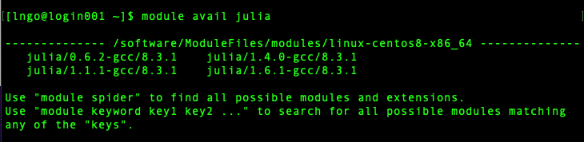
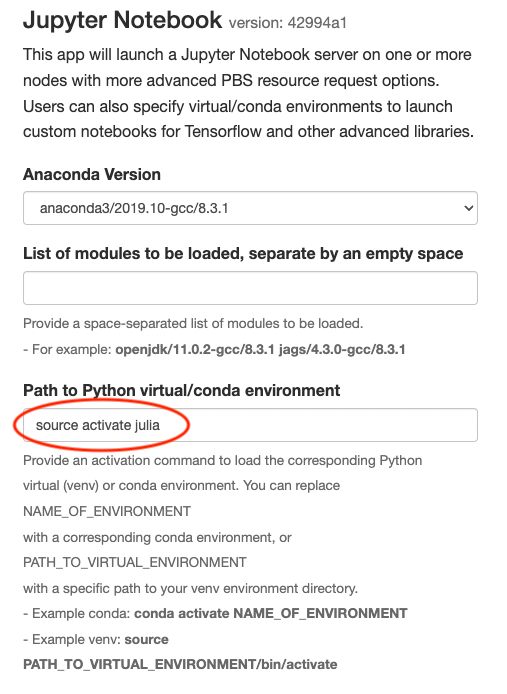
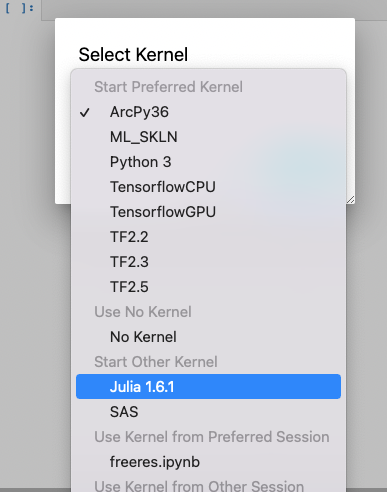
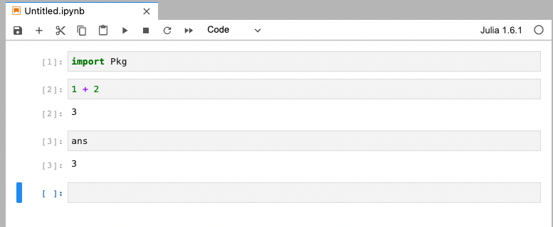

## Julia


Julia: high-level dynamic programming language that was originally designed to address the needs of high-performance numerical analysis and computational science.


### Run Julia in Palmetto: Interactive

There are a few different versions of Julia available on the cluster.




Let demonstrate how to use julia/1.1.1 in the Palmetto cluster together with Gurobi Optimizer (a commercial optimization solver for linear programming),
quadratic programming, etc. Clemson University has different version of licenses for Gurobi solver.
In this example, I would like to use Julia and Gurobi solver to solve a linear math problem using Palmetto HPC

```
Problems: Maximize x+y
Given the following constrains:

50 x + 24 y <= 2400
30 x + 33 y <= 2100
x >= 5, y >= 45
```

Let prepare a script to solve this problem, named: jump_gurobi.jl.
You can save this file to: /scratch1/$username/Julia/

```
$ qsub -I -l select=1:ncpus=8:mem=16gb:interconnect=fdr,walltime=01:00:00
$ cd /scratch1/$username/Julia
$ nano jump_gurobi.jl
```

Then type/copy the following code to the file jump_gurobi.jl

```
import Pkg
using JuMP
using Gurobi

m = Model(with_optimizer(Gurobi.Optimizer))

@variable(m, x >= 5)
@variable(m, y >= 45)

@objective(m, Max, x + y)
@constraint(m, 50x + 24y <= 2400)
@constraint(m, 30x + 33y <= 2100)

status = optimize!(m)
println(" x = ", JuMP.value(x), " y = ", JuMP.value(y))
```

Save the jump_gurobi.jl file then you are ready to run julia:

```
$ module add julia/1.6.1 gurobi/7.0.2
$ julia
# the julia prompt appears:
julia> 

# Next install Package: JuMP and Gurobi

julia> using Pkg
julia> Pkg.add("JuMP")
julia> Pkg.add("Gurobi")
julia> exit()

Run the julia_gurobi.jl script:

$ julia jump_gurobi.jl
```

### Run Julia in Palmetto: Batch mode

* Alternatively, you can setup a PBS job script to run Julia in batch mode. A sample is below for *submit_julia.sh*:
**You must install the JuMP and Gurobi package first (one time installation)**

```
#!/bin/bash
#PBS -N Julia
#PBS -l select=1:ncpus=8:mem=16gb:interconnect=fdr
#PBS -l walltime=02:00:00
#PBS -j oe

module purge
module add julia/1.6.1 gurobi/7.0.2

cd $PBS_O_WORKDIR
julia jump_gurobi.jl > output_JuMP.txt
```

Submit the job:

`$ qsub submit_julia.sh`

The output file can be found at the same folder: output_JuMP.txt

### Launching Jupyter notebooks running Julia via Open OnDemand 

In addition to traditional compilation of Julia, it is possible to install your own version of Julia and setup kernel to work using Jupterhub.

```
$ qsub -I -l select=1:ncpus=8:mem=16gb:interconnect=fdr,walltime=01:00:00
$ module add anaconda3/2019.10-gcc/8.3.1 julia/1.6.1-gcc/8.3.1
$ conda create -n julia python==3.8 jupyterlab==2.2.0
$ source activate Julia
(julia) [$username@node1234 ~]$
(julia) [$username@node1234 ~]$ julia
julia> 
julia> using Pkg
julia> Pkg.add("IJulia")
julia> exit()
```

In a web browser, sign into Palmetto Open OnDemand via `https://openod02.palmetto.clemson.edu`. Launch the `Jupyter Notebook Interactive App`


Make sure that you specify the `julia` conda environment



Launch a new notebook and select the `Julia 1.6.1` kernel



The Julia kernel should be active in the new notebook



