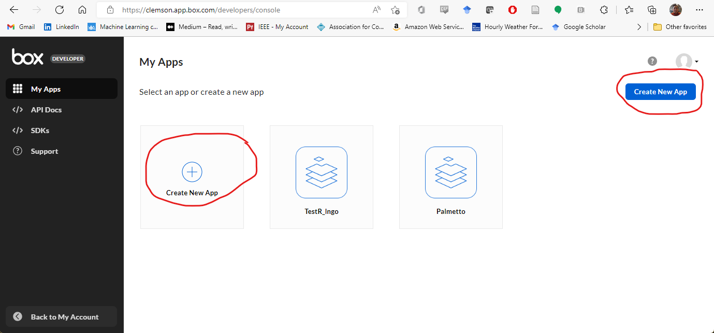
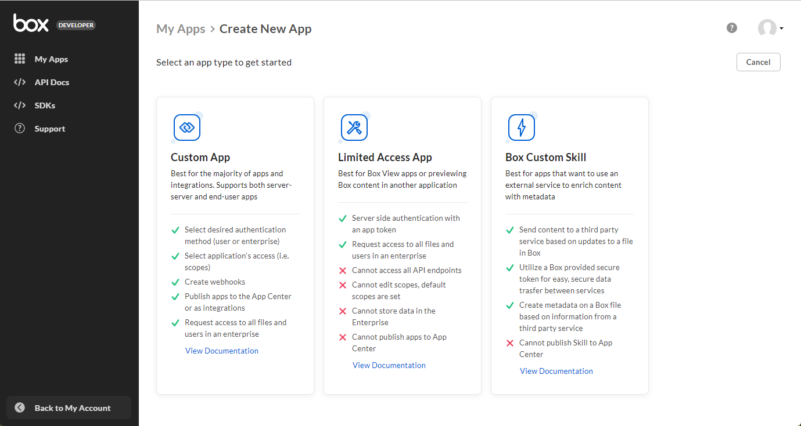
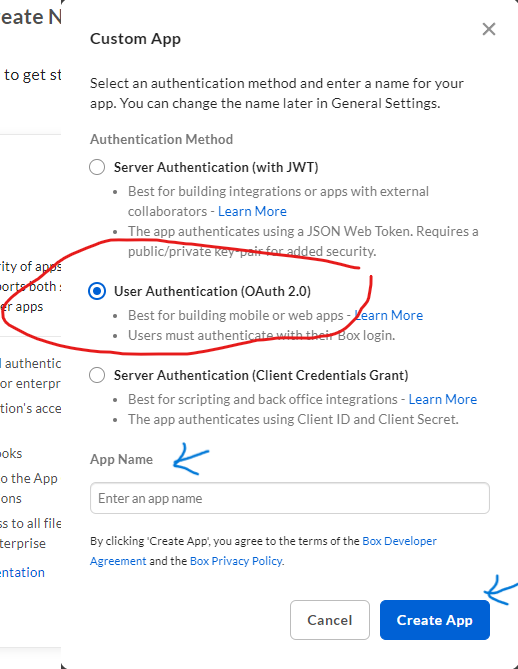
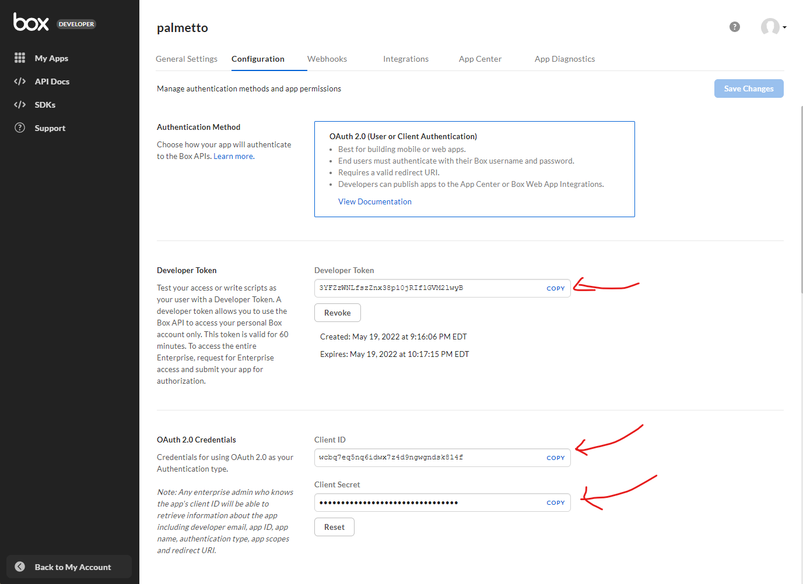
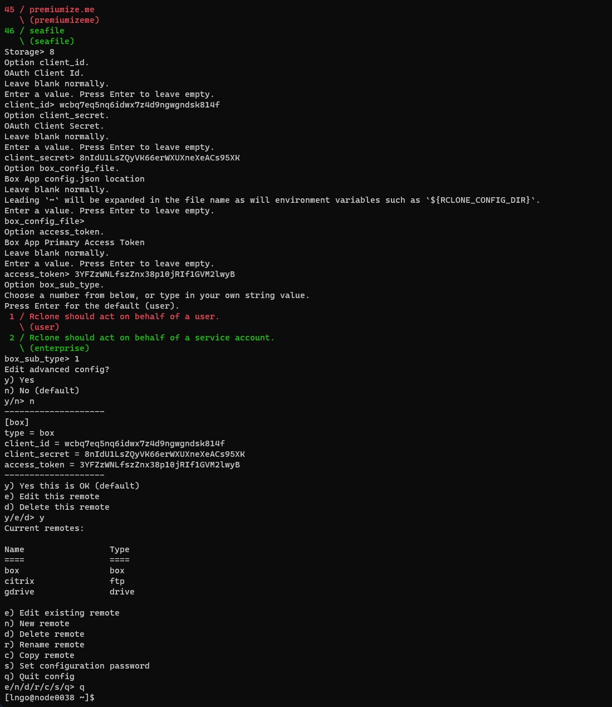
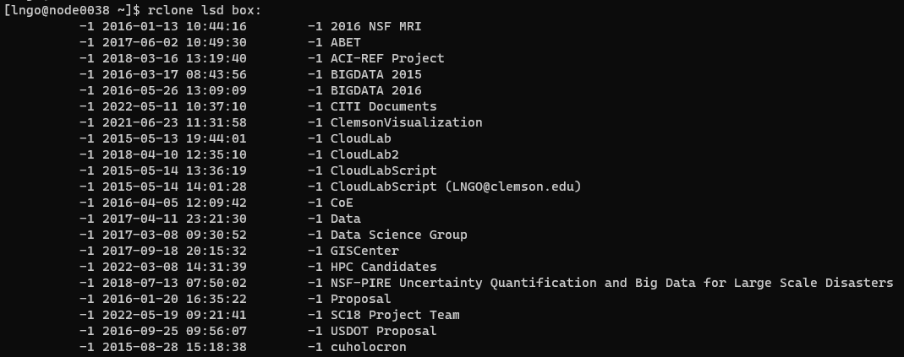
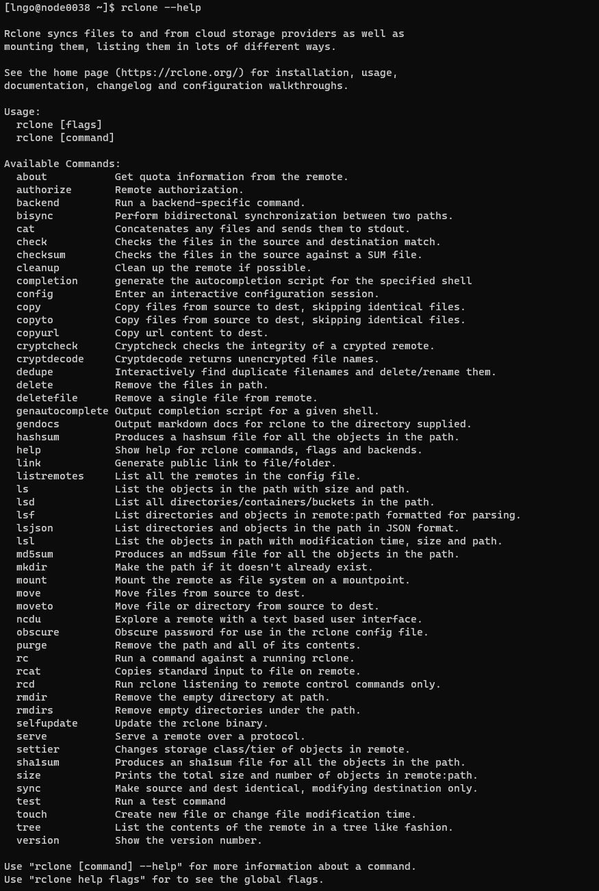
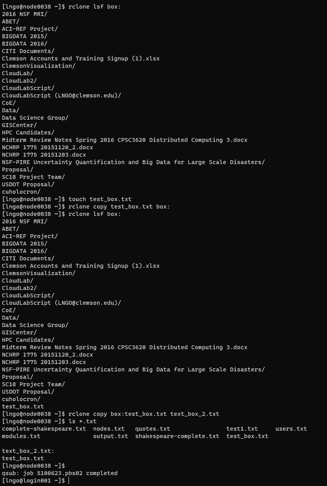

## Setting up rclone for use with Box on Palmetto

Prior to connection `rclone` to `Box` on Palmetto, you will need to
setup a Box app for authentication purposes.

### Setting up a new Box app

- Visit `https://clemson.app.box.com/developers/console` and sign in using
  Clemson's login name and password
- Click `Create New App`



- Select `Custom App`



- Enter App Name, you can call the app `palmetto`.
- Select Automation for Purpose
- Click Next
- Select `User Authentication (OAuth 2.0)`
- Click `Create App`



- In the next Configuration windows, there are three items in the app the you need to use to enter
  in the `rclone` configuration section later on:
  - Developer Token
  - Client ID
  - Client Secret



- Scroll down the Configuration windows and check the box on `Write all files and folders 
stored in Box`.

  - Click `Save Changes`.

- At this point, use your favorite terminal (or OpenOD02 browser terminal),
  log onto Palmetto, and get a compute node.

### Setting up rclone for Box

- After you get on a compute node, load the `rclone` module:

```
module add rclone/1.62.2-gcc/9.5.0
```

- After `rclone` is loaded, you must set up a "remote". In this case,
  we will configure a remote for Google Drive. You can create and manage a separate
  remote for each cloud storage service you want to use.
  Start by entering the following command:

```
rclone config
```

This will bring the lost of options:

```
e) Edit existing remote
n) New remote
d) Delete remote
r) Rename remote
c) Copy remote
s) Set configuration password
q) Quit config
e/n/d/r/c/s/q>
```

- Press `n` then `Enter` to create a new remote host.

```
name>
```

- Provide any name for this remote host. Let's call this one **box**, then press `Enter`.
- Next, `rclone` is going to give you a lengthy list of different possible storage connector.
  We are going to choose `8` for `Box`, then press `Enter`.

```
Choose a number from below, or type in your own value
  1 / 1Fichier
   \ (fichier)
 2 / Akamai NetStorage
   \ (netstorage)
 3 / Alias for an existing remote
   \ (alias)
 4 / Amazon Drive
   \ (amazon cloud drive)
 5 / Amazon S3 Compliant Storage Providers including AWS, Alibaba, Ceph, China Mobile, Digital Ocean, Dreamhost, IBM COS, Lyve Cloud, Minio, Netease, RackCorp, Scaleway, SeaweedFS, StackPath, Storj, Tencent COS and Wasabi
   \ (s3)
 6 / Backblaze B2
   \ (b2)
 7 / Better checksums for other remotes
   \ (hasher)
 8 / Box
   \ (box)
 9 / Cache a remote
   \ (cache)
10 / Citrix Sharefile
   \ (sharefile)
11 / Compress a remote
   \ (compress)
12 / Dropbox
   \ (dropbox)
13 / Encrypt/Decrypt a remote
   \ (crypt)
14 / Enterprise File Fabric
   \ (filefabric)
15 / FTP Connection
   \ (ftp)
16 / Google Cloud Storage (this is not Google Drive)
   \ (google cloud storage)
17 / Google Drive
   \ (drive)
18 / Google Photos
   \ (google photos)
19 / Hadoop distributed file system
   \ (hdfs)
20 / Hubic
   \ (hubic)
21 / In memory object storage system.
   \ (memory)
22 / Jottacloud
   \ (jottacloud)
23 / Koofr, Digi Storage and other Koofr-compatible storage providers
   \ (koofr)
24 / Local Disk
   \ (local)
25 / Mail.ru Cloud
   \ (mailru)
26 / Mega
   \ (mega)
27 / Microsoft Azure Blob Storage
   \ (azureblob)
28 / Microsoft OneDrive
   \ (onedrive)
29 / OpenDrive
   \ (opendrive)
30 / OpenStack Swift (Rackspace Cloud Files, Memset Memstore, OVH)
   \ (swift)
31 / Pcloud
   \ (pcloud)
32 / Put.io
   \ (putio)
33 / QingCloud Object Storage
   \ (qingstor)
34 / SSH/SFTP Connection
   \ (sftp)
35 / Sia Decentralized Cloud
   \ (sia)
36 / Storj Decentralized Cloud Storage
   \ (storj)
37 / Sugarsync
   \ (sugarsync)
38 / Transparently chunk/split large files
   \ (chunker)
39 / Union merges the contents of several upstream fs
   \ (union)
40 / Uptobox
   \ (uptobox)
41 / Webdav
   \ (webdav)
42 / Yandex Disk
   \ (yandex)
43 / Zoho
   \ (zoho)
44 / http Connection
   \ (http)
45 / premiumize.me
   \ (premiumizeme)
46 / seafile
   \ (seafile)
Storage>
```

- The next question for configuraiton asks for `client_id`.
  This is where you copy the string from the `Client ID` box in your Box App
  configuration section earlier and paste it to the terminal.
- Similarly, `rclone` will continue to ask for `client_secret`, which is
  the string from the `Client Secret` box in your Box App configuration section.
- Press `Enter` to leave empty when asked about `box_config_file`.
- Provide the string from the `Developer Token` box in your Box App configuration
  section when asked for `access_token`.
  - **This access token is only valid for 60 minutes. This is for security purpose**.
  - After 60 minutes, you will need to visit your Box App config and generate a new
    token. To switch out this token, first run `rclone config file` to get the location
    of the `rclone.conf` file. Open and edit the `access_token` string of `[box]` in this
    file.
- When asked to fill in the option box_sub_type, select Rclone should act on
  behalf of a service account (enterprise).



To test, run the following command to display the content of your Box drive:

```
$ rclone lsd box:
```



To view `rclone` commands to access your files and directories on box, run

```
$ rclone --help
```



Run the following sequence of commands to validate box operations:

```
$ rclone lsf box:
$ touch test_box.txt
$ rclone copy test_box.txt box:
$ rclone lsf box:
$ rclone copy box:test_box.txt text_box_2.txt
$ ls *.txt
```


