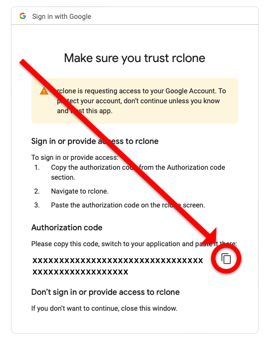

# `rclone` Google Drive

`rclone` is a command-line program that can be used to sync files and folders to
and from cloud services such as Google Drive, Amazon S3, Dropbox, and
[many others](http://rclone.org/).

In this example, we will show how to use `rclone` to sync files to a Google
Drive account, but the official documentation has specific instructions for
other services.

## Setting up rclone for use with Google Drive on Palmetto

To use `rclone` with any of the above cloud storage services, you must perform a
one-time configuration. You can configure `rclone` to work with as many services
as you like.

Please make sure you do not run these instructions on the login node.
[Start a new interactive session](https://www.palmetto.clemson.edu/palmetto/basic/#start-an-interactive-job)
before continuing.

After you get on a compute node, load the `rclone` module:

```
module load rclone/1.62.2-gcc/9.5.0
```

After `rclone` is loaded, you must set up a "remote". In this case, we will
configure a remote for Google Drive. You can create and manage a separate remote
for each cloud storage service you want to use.

Start by entering the following command:

```
rclone config
```

This will display a list of options:

```
e) Edit existing remote
n) New remote
d) Delete remote
r) Rename remote
c) Copy remote
s) Set configuration password
q) Quit config
e/n/d/r/c/s/q>
```

Hit **n** then Enter to create a new remote host.

```
name>
```

Type any name for this remote host, then press return. For example:
**gmaildrive**

```
Choose a number from below, or type in your own value
 1 / 1Fichier
   \ "fichier"
 2 / Alias for an existing remote
   \ "alias"
 3 / Amazon Drive
   \ "amazon cloud drive"
 4 / Amazon S3 Compliant Storage Provider (AWS, Alibaba, Ceph, Digital Ocean, Dreamhost, IBM COS, Minio, etc)
   \ "s3"
 5 / Backblaze B2
   \ "b2"
 6 / Box
   \ "box"
 7 / Cache a remote
   \ "cache"
 8 / Citrix Sharefile
   \ "sharefile"
 9 / Dropbox
   \ "dropbox"
10 / Encrypt/Decrypt a remote
   \ "crypt"
11 / FTP Connection
   \ "ftp"
12 / Google Cloud Storage (this is not Google Drive)
   \ "google cloud storage"
13 / Google Drive
   \ "drive"
14 / Google Photos
   \ "google photos"
15 / Hubic
   \ "hubic"
16 / In memory object storage system.
   \ "memory"
17 / JottaCloud
   \ "jottacloud"
18 / Koofr
   \ "koofr"
19 / Local Disk
   \ "local"
20 / Mail.ru Cloud
   \ "mailru"
21 / Mega
   \ "mega"
22 / Microsoft Azure Blob Storage
   \ "azureblob"
23 / Microsoft OneDrive
   \ "onedrive"
24 / OpenDrive
   \ "opendrive"
25 / Openstack Swift (Rackspace Cloud Files, Memset Memstore, OVH)
   \ "swift"
26 / Pcloud
   \ "pcloud"
27 / Put.io
   \ "putio"
28 / QingCloud Object Storage
   \ "qingstor"
29 / SSH/SFTP Connection
   \ "sftp"
30 / Sugarsync
   \ "sugarsync"
31 / Transparently chunk/split large files
   \ "chunker"
32 / Union merges the contents of several remotes
   \ "union"
33 / Webdav
   \ "webdav"
34 / Yandex Disk
   \ "yandex"
35 / http Connection
   \ "http"
36 / premiumize.me
   \ "premiumizeme"
Storage>
```

Provide any number for the remote source. For example choose number **13** for
Google drive in the above list (your value may differ). In the following questions, always accept the default value:

```
Google Application Client Id - leave blank normally.
client_id> # Enter to leave blank
Google Application Client Secret - leave blank normally.
client_secret> # Enter to leave blank
Scope that rclone should use when requesting access from drive.
Enter a string value. Press Enter for the default ("").
```

Then, it will ask you for access type. You will most likely want full access, so
type **drive**:

```
Choose a number from below, or type in your own value
 1 / Full access all files, excluding Application Data Folder.
   \ "drive"
 2 / Read-only access to file metadata and file contents.
   \ "drive.readonly"
   / Access to files created by rclone only.
 3 | These are visible in the drive website.
   | File authorization is revoked when the user deauthorizes the app.
   \ "drive.file"
   / Allows read and write access to the Application Data folder.
 4 | This is not visible in the drive website.
   \ "drive.appfolder"
   / Allows read-only access to file metadata but
 5 | does not allow any access to read or download file content.
   \ "drive.metadata.readonly"
scope>
```

For the next few questions, accept defaults. At some point, it will ask you for
"remote config":

```
Remote config
Use auto config?
 * Say Y if not sure
 * Say N if you are working on a remote or headless machine or Y didn't work
y) Yes
n) No
y/n>
```

Type **n** for no. This will generate a link that will allow you to generate an
authorization code from Google.

```
Please go to the following link: https://accounts.google.com/o/oauth2/auth?some_secret_information_here
Log in and authorize rclone for access
Enter verification code>
```

Copy the link from **your terminal** and open it in a web browser on your computer.
Follow the Google sign-in prompts, carefully selecting the account you wish to
use. At the end of this process, you should see a screen like this:



Press the button to copy the authorization code on that screen. Then, return to
your Palmetto terminal session, paste the authorization code, and press the
return key.

There is one last question about Team Drives. Accept the default.

Now the configuration will display to you for review.

```
--------------------
[gmaildrive]
type = drive
scope = drive
token = {"access_token":" ... "}
--------------------
y) Yes this is OK (default)
e) Edit this remote
d) Delete this remote
y/e/d> y
```

Select **y** to finish configure this remote host. The **gmaildrive** host will
then be created.

```
Current remotes:

Name                 Type
====                 ====
gmaildrive           drive

e) Edit existing remote
n) New remote
d) Delete remote
q) Quit config
e/n/d/q>
```

After this, you can quit the config using **q**, and exit the compute node:

```
exit
```
