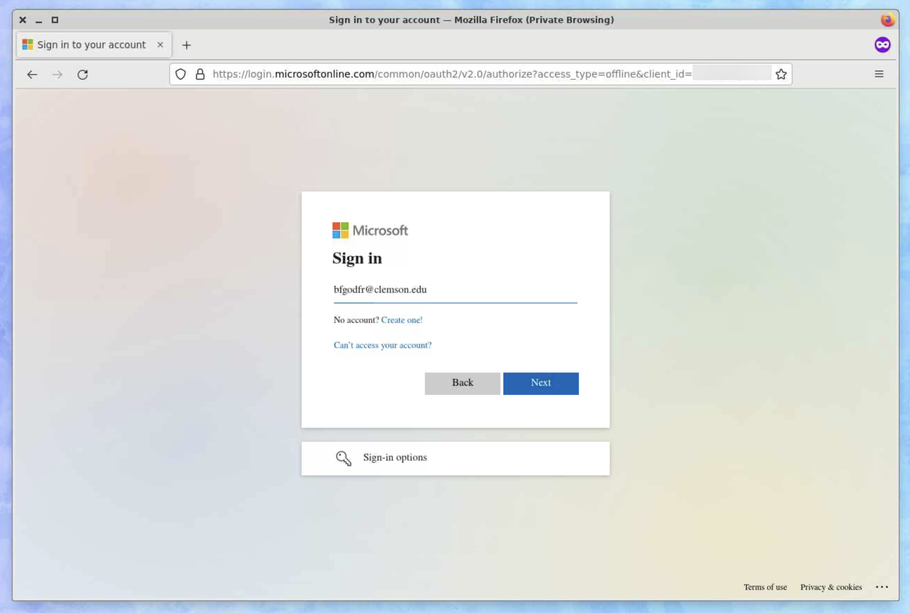
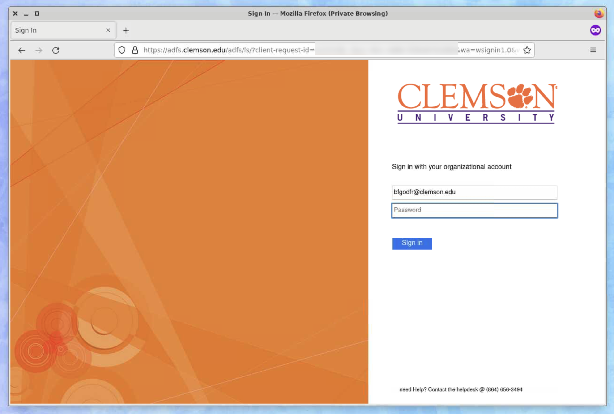

# `rclone` OneDrive

`rclone` is a command-line program that can be used to sync files and folders to
and from cloud services such as Google Drive, Amazon S3, Dropbox, and
[many others](http://rclone.org/).

In this example, we will show how to use `rclone` to sync files to a Microsoft
OneDrive account, but the official documentation has specific instructions for
other services.

## Setting up rclone for use with Microsoft OneDrive on Palmetto

To use `rclone` with any of the above cloud storage services, you must perform a
one-time configuration. You can configure `rclone` to work with as many services
as you like.

Please make sure you do not run these instructions on the login node.

The `rclone` setup requires a web browser, so we will need to use the
**Palmetto Desktop**.

1. Open a new Palmetto Desktop session through Open OnDemand. If you have not
   done this before, please follow the
   [desktop connection instructions](https://docs.rcd.clemson.edu/palmetto/connect/openod/apps/desktop).
1. Once the desktop has loaded, open a Terminal window.
   
1. Next, you must load the `rclone` module.

   ```sh
   module load rclone/1.62.2-gcc
   ```

1. The first time that you load the module, you will need to configure it. This
   process allows `rclone` to access your cloud accounts.

   ```sh
   $ rclone config
   2023/06/13 10:50:07 NOTICE: Config file "/home/bfgodfr/.config/rclone/rclone.conf" not found - using defaults
   No remotes found, make a new one?
   n) New remote
   s) Set configuration password
   q) Quit config
   n/s/q>
   ```

1. You want to create a new remote, so select option `n`.

   ```sh
   $ rclone config
   2023/06/13 10:50:07 NOTICE: Config file "/home/bfgodfr/.config/rclone/rclone.conf" not found - using defaults
   No remotes found, make a new one?
   n) New remote
   s) Set configuration password
   q) Quit config
   n/s/q> n
   ```

1. You are prompted for a name for the remote. Choose a name that you like.
   In this example, I will use `odrive`.

   ```sh
   Enter name for new remote.
   name> odrive
   ```

1. Then, you will need to tell `rclone` which cloud storage provider you want
   to use.

   Enter `onedrive` to select Microsoft OneDrive.

   ```sh
   Option Storage.
   Type of storage to configure.
   Choose a number from below, or type in your own value.
   ...
   31 / Microsoft OneDrive
      \ (onedrive)
   ...
   Storage> onedrive
   ```

1. You will be asked for a **Client ID** and **Client Secret**.

   Leave these blank.

   ```sh
   Option client_id.
   OAuth Client Id.
   Leave blank normally.
   Enter a value. Press Enter to leave empty.
   client_id>

   Option client_secret.
   OAuth Client Secret.
   Leave blank normally.
   Enter a value. Press Enter to leave empty.
   client_secret>
   ```

1. You will need to select a region. Use `global` for Clemson or Personal
   OneDrive accounts.

   ```sh
   Option region.
   Choose national cloud region for OneDrive.
   Choose a number from below, or type in your own string value.
   Press Enter for the default (global).
   1 / Microsoft Cloud Global
     \ (global)
   2 / Microsoft Cloud for US Government
     \ (us)
   3 / Microsoft Cloud Germany
     \ (de)
   4 / Azure and Office 365 operated by Vnet Group in China
     \ (cn)
   region> global
   ```

1. You will be asked if you would like to edit **advanced config**.

   Enter `n` for **no**.

   ```sh
   Edit advanced config?
   y) Yes
   n) No (default)
   y/n> n
   ```

1. Now we are ready to log in to your OneDrive account.

   You will be asked if your machine has a web browser available. Since we
   started this on **Palmetto Desktop**, we can answer `y` for **yes**.

   ```sh
   Use web browser to automatically authenticate rclone with remote?
   * Say Y if the machine running rclone has a web browser you can use
   * Say N if running rclone on a (remote) machine without web browser access
   If not sure try Y. If Y failed, try N.

   y) Yes (default)
   n) No
   y/n> y
   ```

1. A web browser will open to help you sign in to OneDrive and grant access to
   `rclone`.

   For this example, we will use Clemson's OneDrive, so we will enter our
   `@clemson.edu` email address.

   

   After redirecting you to the Clemson ADFS login service, enter your
   Clemson credentials.

   

1. After logging in, you will be asked to grant `rclone` access to files in your
   OneDrive. Press **Accept** if you agree to the terms.

   

1. Once you have granted the permissions, you should see a **Success** prompt.

   

1. Return to the Terminal window. You should see message about the successful
   login:

   ```sh
   NOTICE: Got code
   ```

   Then, you will be asked to select the type of connection. Leave this blank
   and press enter to accept the default value.

   ```sh
   Type of connection
   Choose a number from below, or type in an existing string value.
   Press Enter for the default (onedrive).
   1 / OneDrive Personal or Business
      \ (onedrive)
   2 / Root Sharepoint site
      \ (sharepoint)
      / Sharepoint site name or URL
   3 | E.g. mysite or https://contoso.sharepoint.com/sites/mysite
      \ (url)
   4 / Search for a Sharepoint site
      \ (search)
   5 / Type in driveID (advanced)
      \ (driveid)
   6 / Type in SiteID (advanced)
      \ (siteid)
      / Sharepoint server-relative path (advanced)
   7 | E.g. /teams/hr
      \ (path)
   config_type> onedrive
   ```

1. Next, you will be asked to select which drive from this account you want to
   use.

   Leave this blank and press enter to accept the default value.

   ```sh
   Select drive you want to use
   Choose a number from below, or type in your own string value.
   Press Enter for the default (b!-qwertyUIOPasdf0123456789ghJKLzxcvbNm).
   1 / OneDrive (business)
      \ (b!-qwertyUIOPasdf0123456789ghJKLzxcvbNm)
   config_driveid>
   ```

1. You will then be asked to confirm the drive URL. Enter `y` for yes.

   ```sh
   Drive OK?

   Found drive "root" of type "business"
   URL: https://clemson-my.sharepoint.com/personal/bfgodfr_clemson_edu/Documents

   y) Yes (default)
   n) No
   y/n> y
   ```

1. Finally, you will be asked to approve the connection details.
   Enter `y` for yes to ocnfirm the details.

   ```sh
   Configuration complete.
   Options:
   - type: onedrive
   - token: {
      "access_token":"XXXXXXXXXXXXXXXXXXXXXXXXXXXXXXXXXXXXXXXXXXXXXXXXXXXX",
      "token_type":"Bearer",
      "refresh_token":"XXXXXXXXXXXXXXXXXXXXXXXXXXXXXXXXXXXXXXXXXXXXXXXXXXXX",
      "expiry":"2023-05-05T06:42:18.492747234-04:00"
   }
   - drive_id: b!-qwertyUIOPasdf0123456789ghJKLzxcvbNm
   - drive_type: business
   Keep this "odrive" remote?
   y) Yes this is OK (default)
   e) Edit this remote
   d) Delete this remote
   y/e/d> y
   ```

1. At this point, you will be returned to the main menu, and a list of currently
   configured storage providers will appear.

   Enter `q` to exit the configuration and save.

   ```sh
   Current remotes:

   Name                 Type
   ====                 ====
   odrive               onedrive

   e) Edit existing remote
   n) New remote
   d) Delete remote
   r) Rename remote
   c) Copy remote
   s) Set configuration password
   q) Quit config
   e/n/d/r/c/s/q> q
   ```

## Using OneDrive after setup

See the [**Using `rclone`**](../README.md#using-rclone) instructions after
you complete setup.
