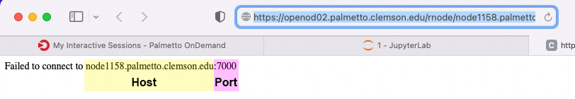

## Tensorflow

This page explains how to install the [TensorFlow](https://www.tensorflow.org/)
package for use with GPUs on the cluster,
and how to use it from Jupyter Notebook via [JupyterHub](https://www.palmetto.clemson.edu/palmetto/jupyterhub_index.html).

This guide is created primarily for TensorFlow 2+. This version of TensorFlow requires AVX2 support 
from CPU, which is not available on the older nodes. Currently Palmetto nodes from **Phase 12 and up** support AVX2. 

We will also include notes on how to setup TensorFlow 1. Since TensorFlow 1 distributions are no 
longer available via pip, the installation instruction will specify local installation pip wheels. 
The current versions available are `1.13.1`, `1.14.0`, and `1.15.0`.  

If you are using codes built using TensorFlow 1, please refer to 
this [migration documentation](https://www.tensorflow.org/guide/migrate) to help with your code. 

### Installing TensorFlow 2.x

1) Request an interactive session. Request a GPU or without GPU depending on your need. 

~~~
$ qsub -I -l select=1:ncpus=24:mem=125gb:ngpus=2:gpu_model=k40:interconnect=10ge,walltime=72:00:00
~~~

or 

~~~
$ qsub -I -l select=1:ncpus=24:mem=125gb:interconnect=10ge,walltime=72:00:00
~~~

2) Load the Anaconda module:
~~~
$ module load anaconda3/2021.05-gcc/8.3.1 cuda/11.0.3-gcc/7.5.0 cudnn/8.0.0.180-11.0-linux-x64-gcc/7.5.0
~~~

3) Create a conda virtual environment:

~~~
$ conda create -n tf_2.5 python=3.8
~~~

4) Activate the virtual environment:
~~~
$ source activate tf_2.5
~~~

5) Install TensorFlow and supporting libraries
~~~
$ export PYTHONNOUSERSITE=1
$ pip install tensorflow==2.5 pandas jupyterlab
~~~

### Install TensorFlow 1.x

This example is for tensorflow version `1.15.0`. You can change it with `1.14.0` or `1.13.1` files:

~~~
$ ls -l /zfs/citi/tf_downloads/
total 1641262
-rw-r--r-- 1 lngo citi  39765989 Nov  9  2016 tensorflow-0.11.0-cp27-none-linux_x86_64.whl
-rw-r--r-- 1 lngo citi  92637477 Feb 26  2020 tensorflow-1.13.1-cp37-cp37m-manylinux1_x86_64.whl
-rw-r--r-- 1 lngo citi 109275882 Feb 26  2020 tensorflow-1.14.0-cp37-cp37m-manylinux1_x86_64.whl
-rw-r--r-- 1 lngo citi 412289319 Feb 26  2020 tensorflow-1.15.0-cp37-cp37m-manylinux2010_x86_64.whl
-rw-r--r-- 1 lngo citi 344955697 Feb 26  2020 tensorflow_gpu-1.13.1-cp37-cp37m-manylinux1_x86_64.whl
-rw-r--r-- 1 lngo citi 377100278 Feb 26  2020 tensorflow_gpu-1.14.0-cp37-cp37m-manylinux1_x86_64.whl
-rw-r--r-- 1 lngo citi 411506559 Feb 26  2020 tensorflow_gpu-1.15.0-cp37-cp37m-manylinux2010_x86_64.whl
~~~

1) GPU

~~~
$ qsub -I -l select=1:ncpus=16:mem=62gb:ngpus=2:gpu_model=k20:interconnect=10ge,walltime=72:00:00
$ module purge
$ module load cuda/10.0.130-gcc/7.1.0 cudnn/7.4.1.5-10.0-linux-x64-gcc/8.3.1 anaconda3/2021.05-gcc/8.3.1
$ mkdir -p ~/software/venv
$ python3 -m venv --system-site-packages ./software/venv/tf1_gpu
$ source ~/software/venv/tf1_gpu/bin/activate
$ pip install --ignore-install /zfs/citi/tf_downloads/tensorflow_gpu-1.15.0-cp37-cp37m-manylinux2010_x86_64.whl
$ python3 -m ipykernel install --user --name tf1_gpu --display-name Tensorflow_1_GPU
~~~

2) CPU

~~~
$ qsub -I -l select=1:ncpus=16:mem=62gb:interconnect=10ge,walltime=72:00:00
$ module purge
$ module load anaconda3/2021.05-gcc/8.3.1
$ mkdir -p ~/software/venv
$ python3 -m venv --system-site-packages ./software/venv/tf1_cpu
$ source ~/software/venv/tf1_cpu/bin/activate
$ pip install --ignore-install /zfs/citi/tf_downloads/tensorflow-1.15.0-cp37-cp37m-manylinux2010_x86_64.whl
$ python3 -m ipykernel install --user --name tf1_cpu --display-name Tensorflow_1_CPU
~~~

### Run TensorFlow Jupyter Notebook in Open OnDemand

- Go to [Palmetto's OpenOnDemand](https://openod02.palmetto.clemson.edu/) and sign in. 
- Under `Interactive Apps` tab, select `Jupyter Notebook`. 
- Make the following selections:
  - `Anaconda Version`: `anaconda3/2021.05-gcc/8.3.1`
  - `List of modules to be loaded, separate by an empty space`: `cudnn/8.0.4.30-11.1-linux-x64-gcc/8.4.1 cuda/11.1.0-gcc/8.3.1`
  - `Path to Python virtual/conda environment`: `source activate tf_cpu_2.5`
- Make the remaining selections according to how much resources you would need.
  - The screenshot below uses the same set of resources used for the non-GPU option of tensorflow.
  - Select the `Tensorflow Notebook` from the `Notebook Workflow`. 
- Click `Launch` when done.  

2) With the `jupyterlab` library installed, you do not need any kernel, but the default `Python 3` kernel.

### Setup Tensorboard

TensorFlow 2+ has `tensorboard` included with the installation package. When you first launch the app, 
besides the `Connect to Jupyter` button, you will see a `Connect to TensorBoard` button. This is a 
placeholder to allow you to access a TensorBoard server later on. 

If you click on the button, you will see the error message containing the node address and port. We will 
need this information later. 

1) Open a terminal in your JupyterLab. We will assume that you have run some tensorflow modeling and 
have some log data. 

~~~
$ module load anaconda3/2021.05-gcc/8.3.1 cuda/11.0.3-gcc/7.5.0 cudnn/8.0.0.180-11.0-linux-x64-gcc/7.5.0
$ source activate tf_2.5
$ # GO TO WHERE YOUR LOG DATA IS
$ tensorboard --logdir . --host node1158.palmetto.clemson.edu --port 7000 
~~~

2) Refresh the TensorBoard page to view 

