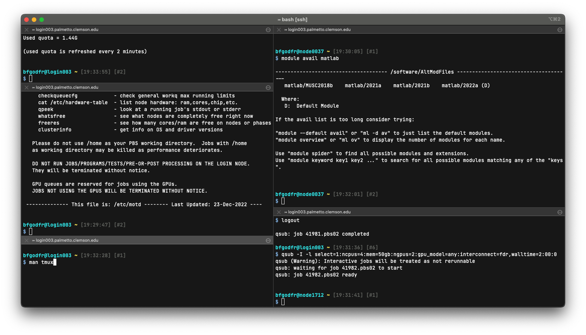
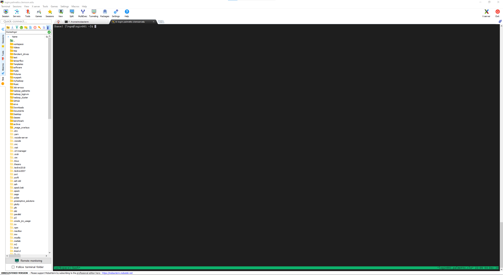

# Using `tmux` on Palmetto

If you would like to run multiple shells in a single window over the same
connection, you can use a terminal multiplexer. One common program that provides
this functionality is `tmux`.



## Setup

Begin by opening your terminal and
[connecting to the login node](../connect/login.md).

Since `tmux` can split your terminal into multiple panes, you will likely want
to **maximize your terminal window**.

After connecting, we will load the `tmux` module. While `tmux` is available
without loading the module, the module provides a newer version that will
provide a better experience.

```sh
$ module load tmux/3.3
$ which tmux
/software/external/tmux/tmux
```

Afterwords, you should copy our configuration file into your home directory.

```sh
cp /zfs/citi/tmux/.tmux.conf ~/
```

You can place the module load command in your `~/.bashrc` if you would like to
always have the new `tmux` version available:

```sh
echo 'module load tmux/3.3' >> ~/.bashrc
```

## `tmux` Commands and Keybindings

Commands to navigate/control `tmux` are often bound to key combinations. The
below examples demonstrate how to properly input the combinations described in
this document.

- **Example 1**: <kbd>Ctrl</kbd><kbd>b</kbd>, then <kbd>d</kbd>.
  1. Press and hold <kbd>Ctrl</kbd>.
  1. Press and hold <kbd>b</kbd>.
  1. Release both <kbd>Ctrl</kbd> and <kbd>b</kbd>.
  1. Press and release <kbd>d</kbd>.
- **Example 2**: <kbd>Ctrl</kbd><kbd>b</kbd>, then <kbd>Shift</kbd><kbd>5</kbd>.
  1. Press and hold <kbd>Ctrl</kbd>.
  1. Press and hold <kbd>b</kbd>.
  1. Release both <kbd>Ctrl</kbd> and <kbd>b</kbd>.
  1. Press and hold <kbd>Shift</kbd>.
  1. Press and hold <kbd>5</kbd>.
  1. Release both <kbd>Shift</kbd> and <kbd>5</kbd>.

<!-- TODO this section is incomplete; only examples of how to press. -->

## `tmux` Views

There are three levels of view in `tmux`: session, windows, and panes.

- Session is the highest level. You can think of a tmux session as a working
  environment for a specific project.
- Let's create our tmux session called `workspace`.

```sh
tmux new -s workspace
```



Within a session there can be multiple windows.
